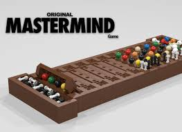

#Mastermind setup:

### bron vermelding
    Boss, R. (2021, 19 januari). HU Structured Programming - Mastermind. Youtube. https://www.youtube.com/watch?v=rSzX2TtjvHA&feature=youtu.be
    Paper groningen universiteit: 
    Kooi, B. (2005). YET ANOTHER MASTERMIND STRATEGY. ICGA Journal, 28(1), 13–20. https://doi.org/10.3233/icg-2005-28105

###	Main programma: communicatie met user met keuze menu uit 4 spel vorm opties
####	Keuze 1: Computer tegen speler
    Invoer user combinatie
    Computer raad fucntie
        Reageren op feedback
        Maximaal 10 probeersels
    Feedback module user Zwarte pinnetjes
    Feedback user witte pinnetjes
####	Keuze 2: Tegen computer spelen speler raad
	Functie voor bedenken code van computer
	Feedback functie van computer

### Pseudo code
#### inv_user_combi()
    Vraag om combinatie met input
    Sla die op in een varriable
#### inv_user_Feedback()
    input() Hoeveel goede plek ui gegeokte combinatie
    input() Hoeveel goedekleuren naast goed plekken uit gegokte combinatie
#### Gues_function()
    for loop tot 4 plekken
    elke plek heeft 6 opties (0-5) en dat is random generated
    geef terug 0 = A, 1 = B,
    